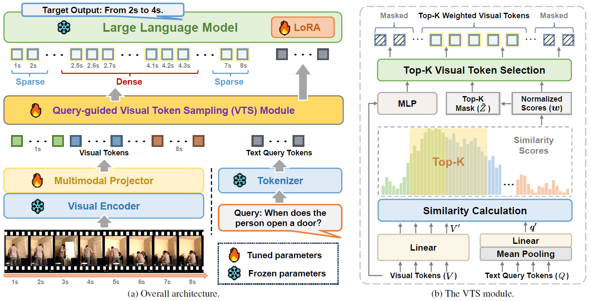

<h2 align="center">GroundVTS: Visual Token Sampling in Multimodal Large Language Models for Video Temporal Grounding</h2>


**CVPR 2026**

This is the official implementation of **GroundVTS**, a Vid-LLM architecture that performs query-guided visual token sampling for video temporal grounding. GroundVTS introduces a **Visual Token Sampling (VTS)** module that dynamically selects the most informative visual tokens conditioned on the textual query, enabling fine-grained and efficient temporal grounding.



## News

- **[2026/06]** Model checkpoints are available on [Hugging Face](https://huggingface.co/Florence123/GroundVTS) and [Model Scope](https://www.modelscope.cn/models/Florence123/GroundVTS).
- **[2026/06]** Code released.
- **[2026/04]** Paper available on [arXiv](https://arxiv.org/abs/2604.02093).
- **[2026/02]** GroundVTS accepted at **CVPR 2026**.
- **[2025/11]** The Grounding-FT dataset is available on [Hugging Face](https://huggingface.co/datasets/Florence123/Grounding-FT-70K) and [Model Scope](https://www.modelscope.cn/datasets/Florence123/Grounding-FT-70K).

## Overview

GroundVTS addresses the limitation of uniform frame sampling in existing Vid-LLMs by introducing a query-guided visual token sampling mechanism. Key features:

- **Visual Token Sampling (VTS) module**: Computes token-query similarity scores and performs weighted differentiable top-K sampling to retain the most informative tokens.
- **Progressive optimization strategy**: A three-stage training pipeline (VTS Warm-up → Joint LoRA Adaptation → Grounding Fine-tuning) that enables stable integration of VTS into existing Vid-LLMs.
- **Architecture-agnostic**: Applicable to different Vid-LLM backbones (demonstrated on Qwen2.5-VL and InternVL3.5).

## Benchmarks

### Moment Retrieval


| Method          | Charades-STA |          |          |          | ActivityNet-Captions |          |          |          |
| --------------- | ------------ | -------- | -------- | -------- | -------------------- | -------- | -------- | -------- |
|                 | R1@.3        | R1@.5    | R1@.7    | mIoU     | R1@.3                | R1@.5    | R1@.7    | mIoU     |
| Qwen2.5VL-7B    | 34.2         | 18.8     | 8.6      | 22.1     | 25.3                 | 11.5     | 4.4      | 17.1     |
| **GroundVTS-Q** | **71.5**     | **57.5** | **34.2** | **50.1** | **51.3**             | **33.6** | **21.4** | **36.0** |
| InternVL3.5-8B  | 35.5         | 25.7     | 13.2     | 24.6     | 22.1                 | 12.0     | 5.6      | 15.8     |
| **GroundVTS-I** | **61.2**     | **44.2** | **23.7** | **41.6** | **37.9**             | **22.4** | **10.3** | **25.7** |


### Highlight Detection (QVHighlights)


| Method          | MR R1@.5 | MR R1@.7 | HD mAP   | HD Hit@1 |
| --------------- | -------- | -------- | -------- | -------- |
| **GroundVTS-Q** | 23.6     | 12.3     | 35.7     | 58.8     |
| **GroundVTS-I** | **63.6** | **40.7** | **52.5** | **88.4** |


## Datasets

### Training Data

- **Stage 1 & 2**: [LLaVA-Video-178K](https://huggingface.co/datasets/lmms-lab/LLaVA-Video-178K) — large-scale video dataset for multimodal pretraining.
- **Stage 3**: **Grounding-FT** — curated from Charades-STA, QVHighlights, and ActivityNet-Captions training splits (70K annotated video-query pairs).

### Evaluation Benchmarks


| Benchmark                                                                                  | Task                     | Split |
| ------------------------------------------------------------------------------------------ | ------------------------ | ----- |
| [Charades-STA](https://prior.allenai.org/projects/charades)                                | Moment Retrieval         | test  |
| [ActivityNet-Captions](http://activity-net.org/challenges/2016/tasks/anet_captioning.html) | Moment Retrieval         | test  |
| [QVHighlights](https://github.com/jayleicn/moment_detr/tree/main/data)                     | MR + Highlight Detection | val   |
| [NExT-GQA](https://github.com/doc-doc/NExT-GQA)                                            | Grounded Video QA        | test  |


## Models


| Model       | Base Model                                                                   | VTS Hidden Dim | Token Ratio |
| ----------- | ---------------------------------------------------------------------------- | -------------- | ----------- |
| GroundVTS-Q | [Qwen2.5-VL-7B-Instruct](https://huggingface.co/Qwen/Qwen2.5-VL-7B-Instruct) | 512            | 0.5         |
| GroundVTS-I | [InternVL3.5-8B](https://huggingface.co/OpenGVLab/InternVL3-8B)              | 128            | 0.5         |


## Installation

We recommend setting up a conda environment for the project.

**For Qwen2.5-VL based model (GroundVTS-Q):**

```bash
conda env create -f requirements/environment_qwen.yml
conda activate VTS_qwen
```

**For InternVL3.5 based model (GroundVTS-I):**

```bash
conda env create -f requirements/environment_intern.yml
conda activate VTS_intern
```

Alternatively, install from requirements files:

```bash
pip install -r requirements/requirements_qwen.txt   # for GroundVTS-Q
pip install -r requirements/requirements_intern.txt  # for GroundVTS-I
```

## Usage

### Data Preparation

1. **Download training data**: Prepare LLaVA-Video-178K and the VTG benchmark training splits.
2. **Generate Grounding-FT dataset**: Convert raw annotations to the LLaMA-Factory format:
  ```bash
   python train/FT_data/data_generation/charades_to_LF.py
   python train/FT_data/data_generation/qvhighlights_to_LF.py
   python train/FT_data/data_generation/qvhighlights_to_LF_HD.py
   python train/FT_data/data_generation/activitynetcap_to_LF.py
  ```
   Update the paths inside each script before running.

### Training

GroundVTS follows a **three-stage progressive optimization strategy**:


| Stage | Description           | Config (Qwen)                   | Config (InternVL)                 |
| ----- | --------------------- | ------------------------------- | --------------------------------- |
| 1     | VTS Warm-up           | `qwen_stage1_vts_warmup.yaml`   | `intern_stage1_vts_warmup.yaml`   |
| 2     | Joint LoRA Adaptation | `qwen_stage2_joint_lora.yaml`   | `intern_stage2_joint_lora.yaml`   |
| 3     | Grounding Fine-tuning | `qwen_stage3_grounding_ft.yaml` | `intern_stage3_grounding_ft.yaml` |


Update paths in the YAML configs (see placeholders), then run:

```bash
# Stage 1: VTS Warm-up
torchrun --nproc_per_node 8 train/src/train.py train/config/train/qwen_stage1_vts_warmup.yaml

# Stage 2: Joint LoRA Adaptation
torchrun --nproc_per_node 8 train/src/train.py train/config/train/qwen_stage2_joint_lora.yaml

# Stage 3: Grounding Fine-tuning
torchrun --nproc_per_node 8 train/src/train.py train/config/train/qwen_stage3_grounding_ft.yaml
```

### Inference

Run inference on evaluation benchmarks. Predictions are written to the directory
given by `--pred_path` (file name is derived from the dataset/split/fps/frames).
Use `--model_type qwen_qts` for GroundVTS-Q or `--model_type intern_qts` for GroundVTS-I.

```bash
# General video temporal grounding benchmarks
python -m eval.infer_auto \
    --model_type qwen_qts \
    --dataset charades_sta \
    --base_model_path <path/to/model> \
    --pred_path <path/to/output_dir>

# QVHighlights (moment retrieval + highlight detection)
python -m eval.infer_qvhighlights \
    --model_type qwen_qts \
    --base_model_path <path/to/model> \
    --pred_path <path/to/output_dir>
```

### Evaluation

Evaluate saved predictions. Here `--pred_path` is the **directory** that holds the
prediction file, and `--pred_name` is the file name (without extension) produced by
the inference step.

```bash
# Moment retrieval evaluation
python -m eval.eval_auto \
    --pred_path <path/to/output_dir> \
    --pred_name output_charades_sta_test_1.0_8

# QVHighlights evaluation
python -m eval.eval_qvhighlights \
    --pred_path <path/to/output_dir> \
    --pred_name output_qvhighlights_valid_2.0_8 \
    --anno_path <path/to/qvhighlights_val.jsonl>
```

### LoRA Merging

Merge LoRA adapters into the base model for deployment:

```bash
python -m eval.merge_lora \
    --base <path/to/base_model> \
    --lora <path/to/lora_adapter> \
    --out <path/to/merged_model>
```

## Project Structure

```
GroundVTS/
├── models/                          # Model architectures
│   ├── module/
│   │   └── vts_module.py            # Visual Token Sampling (VTS) module
│   ├── vts_qwen2_5_vl/             # GroundVTS-Q (Qwen2.5-VL based)
│   ├── vts_internvl_3/             # GroundVTS-I (InternVL3.5 based)
│   ├── qwen2_5_vl/                 # Base Qwen2.5-VL builder
│   └── internvl3_5/                # Base InternVL3.5 builder
├── train/                           # Training pipeline
│   ├── config/
│   │   ├── deepspeed/              # DeepSpeed configs
│   │   └── train/                  # Training stage configs
│   ├── FT_data/data_generation/    # Dataset conversion scripts
│   └── src/                        # LLaMA-Factory based training
├── eval/                            # Evaluation pipeline
│   ├── dataset/                    # Benchmark dataset loaders
│   ├── utils/                      # Evaluation utilities
│   ├── infer_auto.py               # Multi-benchmark inference
│   ├── eval_auto.py                # Multi-benchmark evaluation
│   ├── infer_qvhighlights.py       # QVHighlights inference
│   └── eval_qvhighlights.py        # QVHighlights evaluation
└── requirements/                    # Environment configs
```

## Citation

If you find this work useful, please cite our paper:

```bibtex
@article{fan2026groundvts,
  title={GroundVTS: Visual Token Sampling in Multimodal Large Language Models for Video Temporal Grounding},
  author={Fan, Rong and Xiao, Kaiyan and Zhu, Minghao and Wang, Liuyi and Dai, Kai and Yang, Zhao},
  journal={arXiv preprint arXiv:2604.02093},
  year={2026}
}
```

## License

This project is released under the [Apache 2.0 License](LICENSE).

## Acknowledgements

This project builds upon several excellent open-source projects:

- [LLaMA-Factory](https://github.com/hiyouga/LLaMA-Factory) for the training framework
- [Qwen2.5-VL](https://github.com/QwenLM/Qwen2.5-VL) and [InternVL](https://github.com/OpenGVLab/InternVL) as base models
- [VideoMind](https://github.com/yeliudev/VideoMind) for evaluation scripts
